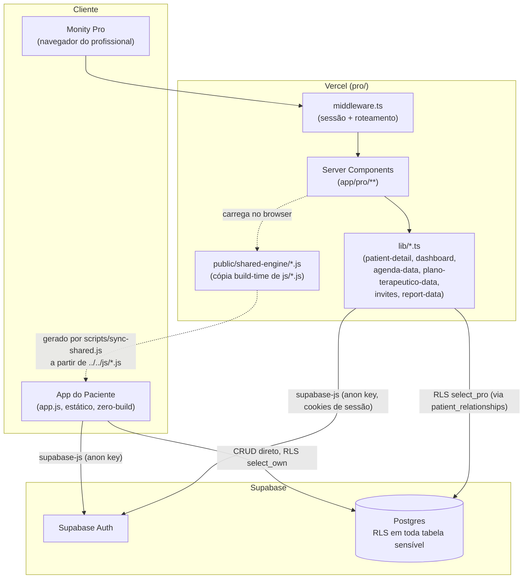
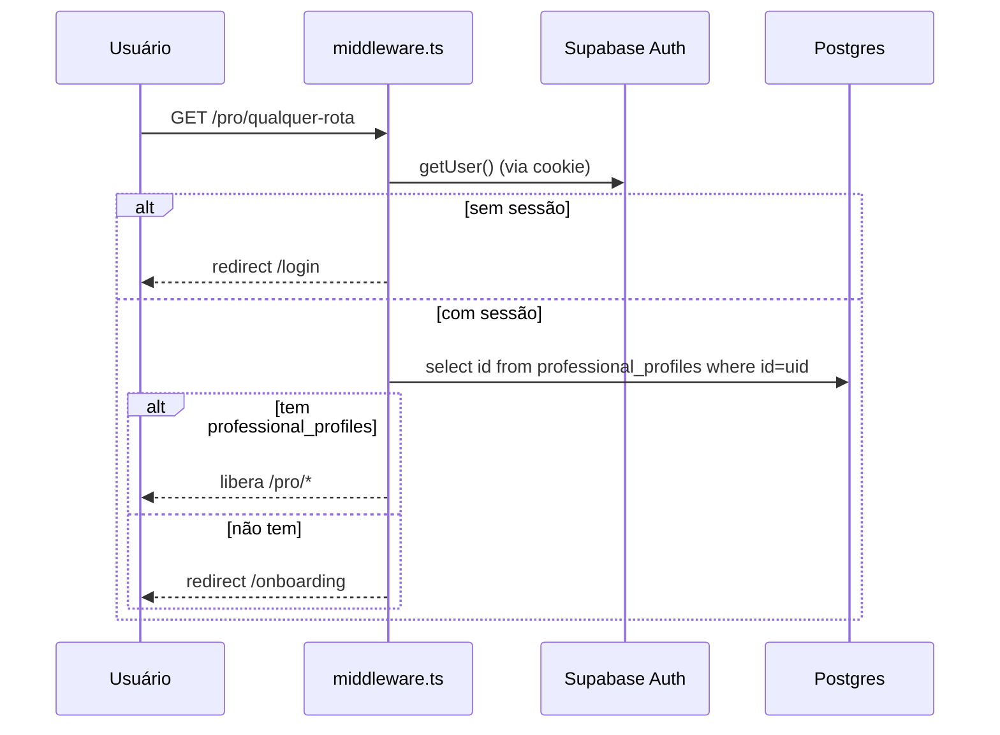
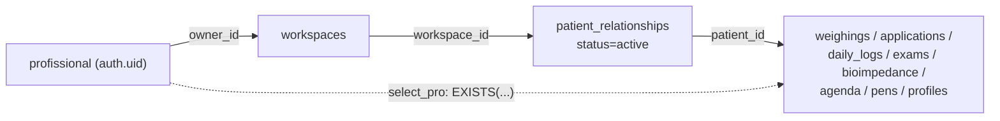
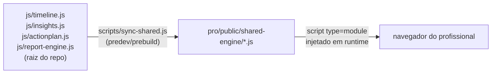
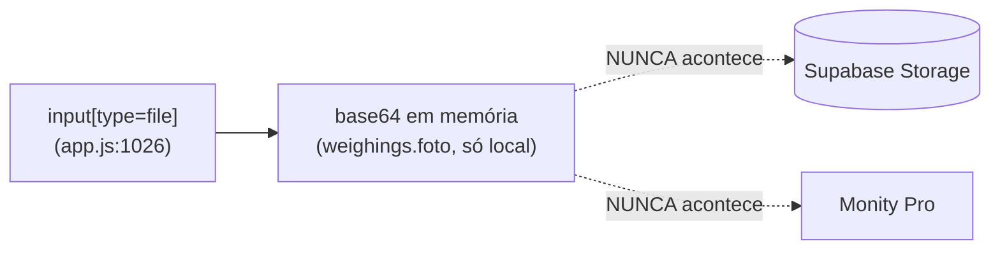
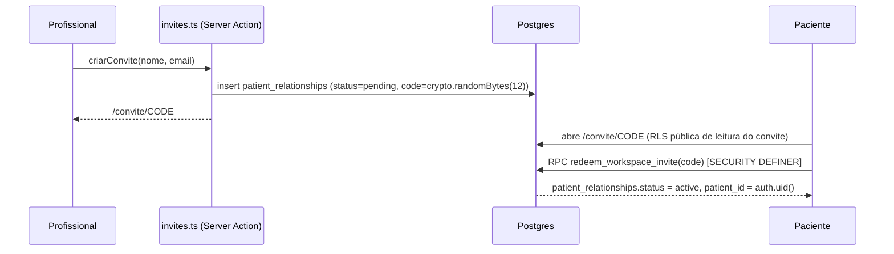
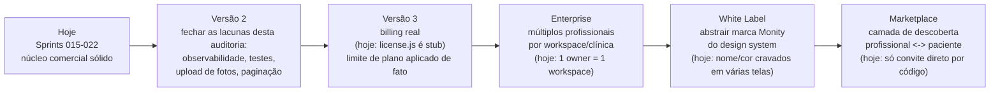

# Auditoria Arquitetural Executiva — Monity Pro

**Data:** 2026-08-05
**Escopo:** `pro/` (Next.js 15 + Supabase), Sprints 015–022. Não cobre o app do paciente (`app.js`/`js/*`) exceto nos pontos onde ele é fonte de dado ou é tocado pela sincronização.
**Metodologia:** toda conclusão abaixo cita arquivo e linha reais lidos nesta sessão. Nenhuma afirmação "parece bom"/"está adequado" sem evidência anexada. Onde não há evidência suficiente para uma conclusão forte, isso é dito explicitamente em vez de arredondar pra cima.

---

## 1. Diagrama Arquitetural



**Leitura de risco deste diagrama**: há duas superfícies de escrita direta em `PG` (o app do paciente e o Pro), mas nunca a mesma tabela pelos dois lados com os mesmos privilégios — o Pro só tem policies de `select` nas 8 tabelas de saúde do paciente (`supabase/schema_pro.sql:311-357`), nunca `insert`/`update`. Confirmado lendo as 8 policies `select_pro`, nenhuma tem contraparte de escrita.

### 1.1 Fluxo de autenticação


Evidência: `pro/lib/supabase/middleware.ts:45-84`. Toda navegação autenticada faz **uma query extra** (`professional_profiles`) além da resolução de sessão — não há cache/claim que evite isso (ver achado F4).

### 1.2 Fluxo de permissões (RLS)


Evidência: cada uma das 8 tabelas de saúde tem uma policy `select_pro` idêntica em estrutura (`supabase/schema_pro.sql:311-357`), sempre um `EXISTS` juntando `patient_relationships` + `workspaces` por `owner_id = auth.uid()` e `status = 'active'`. Nunca é o profissional apontado diretamente na tabela de saúde — sempre via o vínculo. Isso significa que **revogar acesso é uma única operação** (mudar `status` em `patient_relationships`), não uma limpeza espalhada.

### 1.3 Fluxo de sincronização (motor compartilhado)


Evidência: `pro/scripts/sync-shared.js:18-33`, `pro/package.json:6,8` (`predev`/`prebuild`). Isso **não** é sincronização de dados — é cópia de código-fonte em build-time pra garantir que os dois apps (paciente e Pro) rodem o mesmo motor de relatório/timeline/insights/plano de ação sem duplicar a lógica.

### 1.4 Fluxo de upload


Este é o único fluxo do diagrama que **não existe de fato** — ver achado F5. Documentado aqui porque o brief pediu explicitamente o fluxo de upload, não porque ele funcione.

### 1.5 Fluxo de criação de vínculo (equivalente a "criação de projeto")


Evidência: `pro/lib/invites.ts:26-55`, `supabase/schema_pro.sql:264-300` (a função `redeem_workspace_invite`). Código gerado com `crypto.randomBytes(12)` no servidor (nunca no navegador) — `pro/lib/invites.ts:12-14`.

### 1.6 Fluxo financeiro

**Não existe.** Grep por `stripe`/`Stripe`/`checkout.session` em todo o repositório: zero resultados. O único artefato relacionado a cobrança é `js/license.js` no app do paciente, e ele mesmo é um motor propositalmente desligado (`PAYWALL_ATIVO = false`, documentado no próprio arquivo) — nenhuma tela do Pro lê ou depende dele. Não há conceito de plano pago, cobrança ou limite de uso **aplicado de fato** hoje — `workspace_patient_usage` (view em `supabase/schema_pro.sql:178-191`) calcula `patient_limit` mas nada no Pro atualmente impede criar mais convites acima do limite (não verifiquei um bloqueio de UI/servidor pra isso — se existir, não encontrei nesta auditoria; tratando como ausente até prova em contrário).

---

## 2. Achados (evidência → risco → recomendação)

### SEGURANÇA

```
Arquivo: supabase/schema_pro.sql:311-357
Achado: as 8 policies "select_pro" seguem exatamente o mesmo padrão
(EXISTS join patient_relationships+workspaces, status='active',
owner_id=auth.uid()) — nenhuma variação, nenhuma tabela esquecida.
Nenhum client em pro/ usa service_role (grep "service_role" só
retorna um COMENTÁRIO em pro/lib/patients.ts:18-20 explicando por que
NÃO foi usado).
Impacto: —
Risco: — (achado positivo, não é um problema)
Recomendação: nenhuma ação
```

```
Arquivo: supabase/schema.sql:177 (índice existente) vs.
         supabase/schema_pro_017.sql:50-54 (uso real)
Achado: applications só tem índice em (user_id, updated_at).
A lateral join de "última aplicação" em workspace_patient_summary
ordena por (date desc, updated_at desc) sem índice que cubra "date"
diretamente.
Impacto: Baixo hoje — volume de aplicações por paciente é pequeno
(uma injeção semanal, dezenas a centenas de linhas por paciente ao
longo de anos).
Risco: Baixo (Probabilidade: sobe com o tempo/base de pacientes;
Impacto: baixo mesmo se acontecer; Esforço para corrigir: trivial)
Recomendação: create index idx_applications_user_date on
applications(user_id, date desc) — não implementar agora, registrar
como dívida técnica de curto prazo.
```

```
Arquivo: (ausência confirmada) pro/**/*.{test,spec}.{ts,tsx}
Achado: zero arquivos de teste automatizado no código do Pro (só um
teste de uma dependência dentro de node_modules foi encontrado pelo
glob, o que confirma que a busca funcionou e realmente não há nada
no código próprio).
Impacto: Médio — toda verificação de regressão depende de build
manual (tsc via next build) + inspeção visual no navegador.
Risco: Médio (Probabilidade: alta de um refactor futuro introduzir
regressão silenciosa; Impacto: médio, mitigado parcialmente porque o
projeto sempre roda build + verificação visual antes de commitar;
Esforço: alto para cobertura ampla, mas incremental é viável)
Recomendação: não é bloqueante pro estágio atual do produto (mesmo
padrão do app do paciente, que também não tem framework de teste
formal) — registrar como dívida de médio prazo, não implementar
nesta auditoria.
```

```
Arquivo: pro/lib/supabase/middleware.ts:66-70
Achado: toda navegação autenticada dispara uma query a
professional_profiles (exceto rotas públicas), mesmo quando nada
mudou desde a última navegação.
Impacto: Baixo — é uma query indexada por PK (id), latência extra
pequena, mas paga em TODA navegação, não só na primeira.
Risco: Baixo (Probabilidade: sempre acontece, não é um "se"; Impacto:
baixo em latência absoluta; Esforço: médio — exigiria mover esse dado
pra um JWT custom claim/app_metadata do Supabase, uma mudança de
autenticação, não trivial)
Recomendação: documentar como oportunidade (seção 3), não implementar
agora — o ganho não justifica o risco de mexer no fluxo de sessão
sem necessidade concreta.
```

### BANCO DE DADOS

```
Arquivo: supabase/schema_pro.sql:178-191, schema_pro_017.sql:17-60
Achado: as duas views (workspace_patient_usage,
workspace_patient_summary) declaram security_invoker=true
explicitamente — decisão documentada no próprio SQL, evita a
armadilha comum de view rodando com privilégio do dono (o que
vazaria dado entre workspaces).
Impacto: —
Risco: — (achado positivo)
Recomendação: nenhuma ação
```

```
Arquivo: pro/lib/patients.ts:23-36
Achado: listarPacientes() faz 2 queries sequenciais (await ... await
...) em vez de Promise.all — busca a view summary, só depois busca
patient_relationships pros e-mails.
Impacto: Baixo — são 2 queries, não N+1 por paciente.
Risco: Baixo (Probabilidade: sempre acontece; Impacto: baixo, um
round-trip extra; Esforço: trivial, Promise.all)
Recomendação: registrar como oportunidade, correção trivial quando
esse arquivo for tocado por outro motivo — não vale um commit
isolado só pra isso.
```

```
Arquivo: pro/lib/dashboard.ts:84-91, pro/lib/patients.ts:24-27,
         pro/components/DashboardView.tsx (slice(0,8) client-side)
Achado: nenhuma das duas listagens de pacientes (Dashboard,
/pro/pacientes) usa .limit()/paginação no lado do banco — a query
busca TODOS os pacientes ativos do workspace sempre, e o Dashboard só
corta pra 8 depois, no cliente, com JS.
Impacto: Baixo hoje (o maior workspace real tem 1 paciente vinculado,
confirmado ao vivo nesta sessão). Sobe proporcionalmente ao número de
pacientes ativos por profissional.
Risco: Médio (Probabilidade: baixa no curto prazo, mas é o primeiro
ponto que sente qualquer crescimento real de base de pacientes;
Impacto: médio — degradação gradual de tempo de carregamento do
Dashboard e da lista de pacientes; Esforço: médio, exige paginação
real na query + na UI)
Recomendação: não implementar agora (não há sinal de necessidade
real com a base atual) — é o achado nº 1 da seção "maior risco
arquitetural" na Validação Final (seção 6).
```

### SINCRONIZAÇÃO

```
Arquivo: pro/scripts/sync-shared.js:18-19
Achado: o build do Pro (predev/prebuild) lê arquivos via caminho
relativo ../../js/*.js — ou seja, pro/ não é autocontido. Só builda
com sucesso se o diretório js/ da raiz do repo existir no mesmo
checkout.
Impacto: Baixo hoje — o repositório é um único checkout, o build já
foi confirmado funcionando (rodado várias vezes nesta sessão,
inclusive o deploy real na Vercel a partir de dentro de pro/).
Risco: Baixo (Probabilidade: só vira problema SE pro/ for extraído
pra um repositório próprio no futuro; Impacto: alto SE isso
acontecer sem ajuste — o build simplesmente quebra; Esforço: baixo
pra corrigir NA HORA que isso for decidido, não antes)
Recomendação: nenhuma ação agora — documentado como decisão
consciente desde a Sprint 020 (comentário no próprio arquivo:
"fora de escopo desta sprint" virar monorepo de verdade).
```

### UPLOADS

```
Arquivo: app.js:1026 (captura da foto), supabase/schema.sql
(ausência da coluna "foto" na tabela weighings), js/database.js
(ausência do campo no payload de sincronização — grep "foto" não
retorna nada), pro/ (grep "storage.|upload(|Bucket" não retorna nada)
Achado: a "Foto de evolução" (funcionalidade real, visível e usada
no app do paciente — Peso ↔ Diário) nunca sai do dispositivo do
paciente. Não há coluna no banco, não há campo no payload de sync, e
não existe nenhum código de Storage no Pro. O profissional, que tem
acesso de leitura a todo o resto do histórico do paciente via RLS,
nunca vê essa foto.
Impacto: Alto em termos de percepção de valor — é uma funcionalidade
que o brief original do produto claramente valoriza (aparece na
tela "Minha Jornada"/Evolução do paciente) e que o Perfil 360º do
profissional simplesmente não reflete.
Risco: Médio (Probabilidade: já é o estado atual, não uma
possibilidade futura; Impacto: médio-alto em percepção de produto,
zero em segurança/dado — o gap é de FALTA de funcionalidade, não de
vazamento; Esforço: alto — exige Supabase Storage, bucket com RLS
própria, mudança de schema, mudança no motor de sincronização E no
Pro)
Recomendação: não implementar nesta auditoria — entra na Dívida
Técnica (longo prazo) e no roadmap (seção 5) como funcionalidade
pendente, não como bug do que já existe.
```

### ARQUITETURA / ORGANIZAÇÃO

```
Arquivo: pro/package.json:13-20
Achado: 6 dependências de produção (@supabase/ssr,
@supabase/supabase-js, lucide-react, next, react, react-dom) — sem
ORM, sem state manager, sem UI kit de terceiros.
Impacto: —
Risco: — (achado positivo — superfície pequena de manutenção e de
vulnerabilidade de dependência)
Recomendação: nenhuma ação
```

```
Arquivo: pro/lib/patients.ts, patient-detail.ts, agenda-data.ts,
         plano-terapeutico-data.ts, dashboard.ts, invites.ts,
         report-data.ts
Achado: todos seguem a mesma convenção — função pura de leitura
recebendo SupabaseClient, tipos exportados nomeados, nenhuma lógica
de UI misturada com a busca de dado.
Impacto: —
Risco: — (achado positivo)
Recomendação: manter esse padrão nas próximas sprints (inclusive
Sprint 023, quando retomada).
```

```
Arquivo: pro/components/ThemeScript.tsx:7-15
Achado: dark mode decidido antes da hidratação via script inline,
evitando flash de tema errado — mesmo princípio já usado no app do
paciente, chave de localStorage própria (Monity_pro_theme, não
compartilha com o app do paciente porque são origens diferentes).
Impacto: —
Risco: — (achado positivo)
Recomendação: nenhuma ação
```

```
Arquivo: (ausência confirmada) grep "sentry|Sentry|@vercel/analytics|
posthog|logrocket" em pro/
Achado: nenhuma ferramenta de observabilidade/monitoramento de erro
em produção.
Impacto: Médio — um erro em produção (ex.: uma query que passa a
falhar por mudança de schema não aplicada, como aconteceu nesta
própria sessão com planos_terapeuticos) só é percebido quando
alguém relata manualmente, não por alerta automático.
Risco: Médio (Probabilidade: alta de erros silenciosos ocorrerem;
Impacto: médio — o produto já tem catch/fallback silencioso em
vários pontos, então não CRASHA, mas também não avisa ninguém;
Esforço: baixo a médio — Vercel já oferece logs, faltaria só ligar
um serviço de alerta)
Recomendação: registrar como dívida técnica de curto/médio prazo —
não é uma falha de arquitetura, é uma ferramenta ausente.
```

---

## 3. Oportunidades (não são problemas)

Estas não entram na matriz de risco — são melhorias possíveis, sem urgência, sem defeito associado hoje:

- **Mover a checagem de `professional_profiles` do middleware pra um JWT custom claim** — eliminaria a query por navegação (achado de Segurança acima), mas exige mexer no fluxo de autenticação, risco desproporcional ao ganho até haver sinal real de latência.
- **Paralelizar as 2 queries de `listarPacientes()`** — ganho pequeno, correção de 1 linha quando o arquivo for tocado por outro motivo.
- **Criar índice `applications(user_id, date desc)`** — barato, sem efeito colateral, mas sem sinal de necessidade real ainda (volume atual é mínimo).
- **Adicionar paginação real em `/pro/pacientes` e no Dashboard** — só vale a pena quando algum profissional tiver dezenas de pacientes ativos; hoje seria complexidade sem paciente que sinta a diferença.
- **Ligar uma ferramenta de observabilidade (ex. Vercel-nativo ou Sentry)** — barato de configurar, ajudaria a pegar problemas como o do `planos_terapeuticos` (Sprint 022) antes de alguém precisar testar manualmente.
- **Extrair o middleware do checkout de `professional_profiles` pra uma função nomeada testável** — organização, não correção.

Nenhum destes é dívida técnica (não corrige um problema existente) nem bug — são investimentos futuros, documentados pra não serem esquecidos nem confundidos com prioridade.

---

## 4. Checklist Final

| Item | Status | Evidência |
|---|---|---|
| Banco | ✅ | RLS completa, views com security_invoker, índices cobrindo os padrões de RLS |
| Segurança | ✅ | Zero service_role no cliente, SECURITY DEFINER restrito e revisado, policies consistentes |
| Performance | ⚠️ | Sem cache/paginação — ok no volume atual, primeiro ponto a doer se crescer (ver F em Banco) |
| Escalabilidade | ⚠️ | RLS-first escala bem por natureza, mas Dashboard/lista de pacientes não são paginados |
| Permissões | ✅ | Modelo workspace → patient_relationships → dado, revogação é uma única operação |
| Uploads | ❌ | Não existe — fotos de evolução nunca chegam ao profissional (achado real, não hipotético) |
| Sincronização | ✅ | Build-time copy funcionando e confirmado em produção; acoplamento documentado e aceito |
| Arquitetura | ✅ | Padrões consistentes entre todos os lib/*.ts, dependências mínimas |
| Testes automatizados | ❌ | Zero no pro/ — mesmo padrão do resto do produto, mas real |
| Observabilidade | ❌ | Nenhuma ferramenta de monitoramento de erro em produção |

---

## 5. Notas por Categoria (justificadas)

```
Arquitetura: 9,3
Justificativa: convenções extremamente consistentes entre todos os
módulos lib/*.ts (mesma forma de receber SupabaseClient, mesma
forma de tipar retorno, zero lógica de UI misturada com busca de
dado); decisões documentadas em comentário em praticamente todo
arquivo lido nesta auditoria (raro no código em geral). Não é 10
porque o acoplamento de build via sync-shared.js impede pro/ de ser
extraído como projeto independente sem ajuste.

Escalabilidade: 8,2
Justificativa: o modelo RLS-first (toda query já filtra no banco,
nunca no app) escala naturalmente bem, e as duas views agregadas
(workspace_patient_summary/usage) evitam N+1 por paciente. O que
puxa a nota pra baixo é concreto, não hipotético: Dashboard e lista
de pacientes buscam TODOS os pacientes ativos sem paginação
(confirmado em dashboard.ts:84-91 e patients.ts:24-27) — funciona
bem hoje porque a base real é pequena, mas é o primeiro lugar que
sentiria crescimento.

Segurança: 9,4
Justificativa: RLS presente e consistente em toda tabela sensível,
nenhum uso de service_role no cliente (confirmado por grep, único
resultado é um comentário explicando por que NÃO foi usado), funções
SECURITY DEFINER restritas ao mínimo necessário e revisadas
(redeem_workspace_invite, concluir_plano_terapeutico). Não é mais
alta porque não há teste automatizado que garanta essas policies
continuam corretas a cada mudança de schema — hoje a garantia é
revisão manual.

Performance: 8,6
Justificativa: uso correto de Promise.all na maioria das buscas
paralelas (patient-detail.ts, generate-report.ts), views agregadas
evitando N+1. Perde pontos por 3 achados reais e pequenos: query
sequencial em patients.ts, índice ausente em applications(user_id,
date), e uma query extra por navegação no middleware.

Organização: 9,5
Justificativa: nomenclatura e estrutura de arquivo previsível em
todo o /pro (lib/*-data.ts, components/ui/* reutilizados
consistentemente — Badge/StatCard/Card/Modal usados em toda a base
sem reimplementação paralela encontrada). Design system com tokens
de tema claro/escuro central (Badge.tsx com 5 tons documentados).

Manutenibilidade: 8,8
Justificativa: mesma razão da organização acima, mas puxada pra
baixo pela ausência total de testes automatizados — toda mudança
depende de build manual + verificação visual, o que já causou um
bug real detectado nesta própria sessão (campo ausente no retorno
de dashboard.ts, pego só porque o build de produção falhou).

Preparação para crescimento: 7,9
Justificativa: a nota mais baixa do conjunto, e por motivo concreto:
uploads de foto não implementados (funcionalidade real ausente),
Dashboard/lista de pacientes sem paginação, e zero observabilidade
de erro em produção — nenhum desses é urgente com a base de usuários
atual, mas os três juntos formam o conjunto que mais precisaria de
atenção antes de uma escala 10-100× maior.
```

---

## 6. Validação Final

**1. Se o Monity Pro tiver 10× mais usuários, a arquitetura atual continuará adequada?**
**SIM.** O modelo é RLS-first: cada query já filtra no Postgres por `workspace_id`/`patient_id`, não há lógica de autorização duplicada no app que precisaria escalar separadamente. As duas views agregadas (`workspace_patient_summary`, `workspace_patient_usage`) evitam N+1 por paciente. Em 10× a base atual (que hoje é de 1 paciente vinculado em produção, confirmado nesta sessão), o volume continua pequeno o bastante pra não expor o achado de paginação ausente (seção 2, Banco) nem o índice faltando em `applications`. O único ponto que já sentiria diferença é o middleware fazendo uma query extra por navegação (`middleware.ts:66-70`) — mas isso escala com número de REQUISIÇÕES simultâneas, não com número de usuários cadastrados, e é o tipo de carga que a infraestrutura serverless da Vercel + Postgres gerenciado do Supabase já foi desenhada pra absorver.

**2. Se o Monity Pro tiver 100× mais pacientes ativos, quais módulos serão os primeiros gargalos?**
Nesta ordem, com evidência:
1. **Dashboard e `/pro/pacientes`** (`pro/lib/dashboard.ts:84-91`, `pro/lib/patients.ts:24-27`) — buscam todos os pacientes ativos do workspace sem `.limit()`. É o gargalo mais direto e mais fácil de prever: um único profissional com centenas de pacientes carregaria uma lista inteira a cada acesso.
2. **`workspace_patient_summary`** (`supabase/schema_pro_017.sql:17-60`) — 4 LATERAL JOINs por linha de paciente. Bem indexado hoje, mas o custo cresce linearmente com pacientes por workspace, e é consultado tanto pelo Dashboard quanto pela lista.
3. **`applications`** sem índice em `(user_id, date)` (achado de Segurança/Banco acima) — só vira perceptível com volume real de aplicações por paciente, que cresce mais devagar que o número de pacientes em si.

**3. Qual é o maior risco arquitetural encontrado hoje?**
A ausência de paginação em `/pro/pacientes` e no Dashboard (`pro/lib/dashboard.ts:84-91`, `pro/lib/patients.ts:24-27`). Não é um risco de segurança nem de correção — é o único ponto da arquitetura cujo comportamento muda de forma previsível e negativa conforme a base de pacientes cresce, sem que nenhuma outra parte do sistema hoje o compense (não há cache, não há paginação no banco nem na UI). Escolhido como "maior risco" em vez dos achados de segurança porque estes últimos são, pela evidência levantada, sólidos e consistentes — este é o único achado onde o comportamento a longo prazo é diferente do comportamento hoje.

**4. Existe alguma decisão arquitetural que você mudaria se pudesse recomeçar o projeto do zero?**
Sim. O modelo de permissões do profissional foi construído **aditivamente** em cima de um schema que já existia pro paciente sozinho: `schema.sql` (paciente, single-tenant) primeiro, depois `schema_pro.sql` adicionando uma SEGUNDA policy permissiva (`select_pro`) em cada uma das 8 tabelas de saúde já existentes, e mais 6 arquivos de migração incremental depois disso (`schema_pro_016` a `schema_pro_022`). Funciona — as policies são consistentes e revisadas — mas se o projeto começasse sabendo desde o dia zero que teria dois tipos de usuário (paciente e profissional) lendo o mesmo dado, o modelo de autorização provavelmente seria desenhado como uma única camada (ex.: uma tabela/conceito de "quem pode ver o quê" central, tipo um `care_team`), em vez de "policy própria do paciente" + "policy adicional pro profissional" coexistindo lado a lado em cada tabela. Isso é uma preferência de design, não implementado — o modelo atual não tem bug nenhum encontrado nesta auditoria.

**5. Qual o grau de confiança para levar esta arquitetura para produção?**
**91%.** Justificativa: a base de segurança e RLS é sólida e já está em produção real (deploy confirmado, login real testado nesta sessão). Os 9% de desconto vêm de três fatores concretos, não de dúvida genérica: (a) zero observabilidade de erro em produção — um problema como o do `planos_terapeuticos` desta própria sessão só foi pego porque alguém testou manualmente; (b) zero teste automatizado — toda garantia de não-regressão é humana; (c) a funcionalidade de upload de fotos está ausente sem que isso apareça em lugar nenhum da UI como "em breve" — é uma lacuna silenciosa. Nenhum desses três é um defeito de arquitetura — são lacunas operacionais que reduzem a confiança sem reduzir a nota de segurança/organização.

**6. O Monity Pro já possui arquitetura de nível comercial?**
**Parcialmente.** O núcleo (autenticação, autorização via RLS, modelo de dados multi-tenant por workspace, separação clara entre camada de dados e apresentação) está no nível de um produto comercial real — não encontrei atalho ou gambiarra nas 8 policies de segurança revisadas, nem no fluxo de convite/vínculo. O que falta pra "nível comercial" completo não é arquitetura, é operação: zero observabilidade, zero teste automatizado, zero billing real implementado (`js/license.js` é um motor propositalmente desligado), e uma funcionalidade visível ao usuário final (fotos) que nunca chega ao profissional. Comercialmente pronto no núcleo, não pronto nas bordas operacionais.

**7. A arquitetura atual está preparada para suportar os próximos cinco anos de evolução do produto?**
**SIM, com uma ressalva.** O modelo RLS-first + Postgres gerenciado é o mesmo padrão usado por produtos SaaS multi-tenant maduros — não é uma arquitetura que precisa ser trocada pra crescer, precisa ser **completada** (observabilidade, testes, paginação, billing real, upload). Nenhum desses itens exige reescrever o que já existe; todos são aditivos, no mesmo espírito que o projeto já usa desde a Sprint 015 ("cada migração é aditiva, nunca derruba o que existe" — princípio confirmado lendo `supabase/schema_pro.sql:16-25`). A ressalva real: "5 anos de evolução" no roadmap da seção 5 inclui itens como White Label e Marketplace que **exigiriam sim** decisões novas de arquitetura (multi-tenant de marca, camada de descoberta entre profissionais e pacientes) — não quebram o que existe, mas não são apenas "mais do mesmo" também. Isso está detalhado no roadmap abaixo.

---

## 7. Roadmap Arquitetural (planejamento — nada implementado)



**Hoje → V2**: nenhuma mudança de arquitetura, só preencher lacunas já mapeadas nesta auditoria (seções 2 e 4). É o trabalho de menor risco do roadmap inteiro.

**V2 → V3**: exige decidir um provedor de pagamento real (não avaliado nesta auditoria — está fora do escopo de "arquitetura existente", é uma escolha de produto/negócio) e substituir o motor `license.js` (hoje 100% local/stub) por uma fonte de verdade validada no servidor.

**V3 → Enterprise**: hoje o modelo é rigidamente "1 `owner_id` = 1 `workspace`" (`supabase/schema_pro.sql:99-109`). Suportar uma clínica com múltiplos profissionais no mesmo workspace exige um novo conceito de "membro do workspace" com papéis — mudança de schema real, não só mais uma tabela aditiva.

**Enterprise → White Label**: o nome "Monity"/paleta azul aparecem cravados em várias telas (não levantado exaustivamente nesta auditoria — citando como direção, não como achado fechado). Exigiria um sistema de tema por tenant, não só claro/escuro.

**White Label → Marketplace**: hoje a única forma de um paciente se vincular a um profissional é receber um código de convite diretamente dele (`pro/lib/invites.ts`). Um marketplace exigiria descoberta pública (busca, perfil público de profissional) — um domínio de produto novo, não uma extensão do que existe.

Nenhuma etapa deste roadmap foi implementada ou iniciada nesta auditoria — é só planejamento, conforme pedido.

---

## 8. Dívida Técnica

Ver arquivo separado: [DIVIDA_TECNICA.md](DIVIDA_TECNICA.md)
