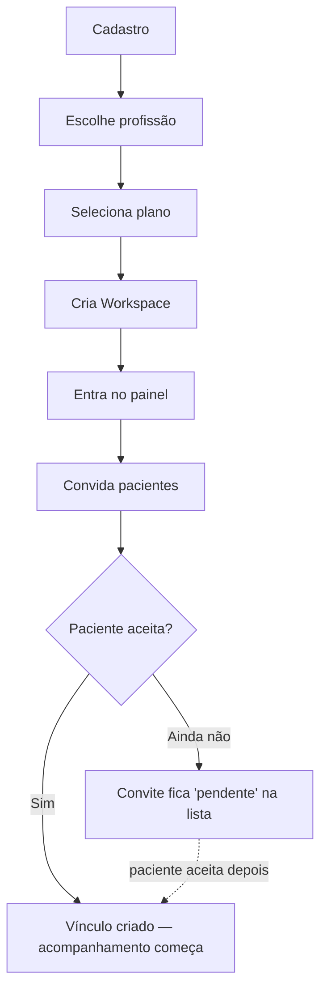
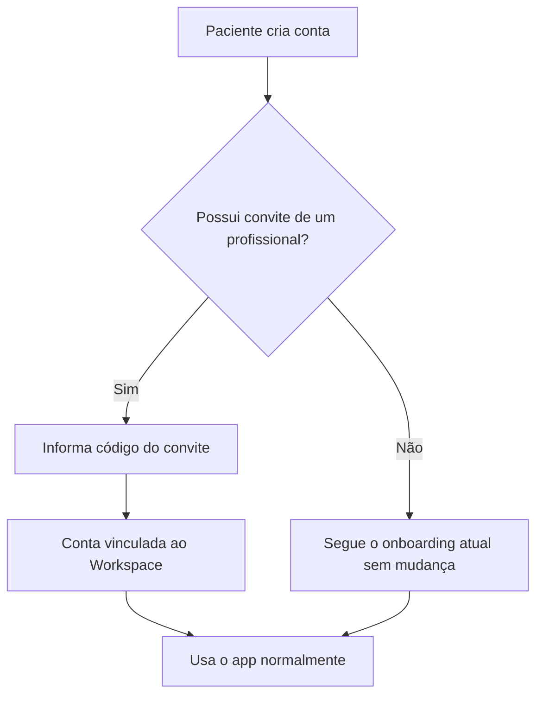

# Monity Pro — Blueprint de Arquitetura (Sprint 014.5)

> Documento de arquitetura. Nenhuma linha de código, migração ou componente foi criado nesta
> sprint — só o mapa que as próximas sprints vão implementar em cima. Toda decisão abaixo tem
> uma justificativa; onde há mais de um caminho razoável, eu escolhi um e expliquei o porquê,
> mas são pontos que você pode revisar antes da Sprint 015 começar a codar.

## Como este documento se encaixa no que já existe

O Monity Paciente é hoje um PWA zero-build (`app.js`/`style.css`/`sw.js`, sem framework, sem
bundler) com Supabase como backend (8 tabelas, todas `RLS` dono-only). Essa arquitetura foi uma
escolha deliberada para o paciente: carregamento instantâneo, funciona offline, zero manutenção
de build. O Monity Pro é um produto genuinamente diferente — painel multi-paciente, tabelas,
filtros, uso majoritariamente em desktop — então este blueprint **não tenta encaixar o Pro
dentro do mesmo `app.js`**. A decisão de arquitetura central (detalhada na seção "Decisões
estruturais") é: **Pro é uma aplicação separada, mesmo backend Supabase.**

---

## 1. Mapa de Navegação

```
Monity Pro
├── Login / Cadastro                          (fora do painel — pré-autenticação)
├── Onboarding                                  (só no 1º acesso — ver Fluxo do Profissional)
│   ├── Escolha de profissão
│   ├── Escolha de plano
│   └── Criação do Workspace
│
└── Painel (autenticado)
    ├── Dashboard                               (visão geral: pacientes ativos, alertas, resumo)
    ├── Pacientes
    │   ├── Lista                               (busca, filtro por status/adesão)
    │   └── Perfil do Paciente                  (abas dentro do mesmo perfil, não rotas profundas)
    │       ├── Visão geral                     (resumo — peso atual, adesão, próxima consulta)
    │       ├── Evolução                        (peso, medidas, IMC — reaproveita lineChartPremium)
    │       ├── Aplicações                      (histórico de doses)
    │       ├── Medidas                         (cintura/quadril/abdômen/coxa/braço)
    │       ├── Bioimpedância
    │       ├── Exames
    │       ├── Linha do Tempo                  (reaproveita TIMELINE.gerar())
    │       └── Relatórios                      (reaproveita buildPDF(), adaptado pro contexto Pro)
    ├── Convites
    │   ├── Enviar convite
    │   └── Convites pendentes / aceitos / expirados
    ├── Assinatura                              (plano do Workspace, cobrança — mesmo padrão do LICENSE.js)
    └── Configurações
        ├── Dados do profissional / workspace
        └── Equipe                              (ver "Fora de escopo" — só estrutura prevista, não construída agora)
```

**Decisão**: "Perfil do Paciente" é um único perfil com abas internas (mesmo padrão que
`evolucaoView()` já usa hoje com `.seg-glass` pra Peso/IMC/Medidas), não 7 rotas profundas
separadas — evita estado de navegação duplicado e é consistente com como o próprio Monity
Paciente organiza telas hoje.

---

## 2. Fluxo do Profissional



Detalhes por etapa:

1. **Cadastro** — e-mail/senha via Supabase Auth (mesmo mecanismo do paciente, `js/auth.js`
   generaliza; ver "Decisões estruturais"). Tela e domínio diferentes do app do paciente.
2. **Escolhe profissão** — nutricionista, médico(a), educador(a) físico(a), psicólogo(a),
   outro. Grava em `professional_profiles.profissao`.
3. **Seleciona plano** — mesmo princípio do `LICENSE_CONFIG.ENABLED=false` da Sprint P: a tela
   de planos existe e grava a escolha, mas o *enforcement* de cobrança real fica desligado até
   existir integração de pagamento — profissional começa a usar o painel imediatamente.
4. **Cria Workspace** — nome da clínica/consultório (ou o próprio nome do profissional, se
   autônomo). Um workspace por profissional nesta fase (ver "Fora de escopo": múltiplos
   membros por workspace é arquitetura prevista, não construída agora).
5. **Entra no painel** — Dashboard vazio, com CTA "Convide seu primeiro paciente".
6. **Convida pacientes** — gera um convite (token, não o `id` do registro — mesmo cuidado de
   segurança já desenhado no rascunho de compartilhamento da Sprint P antiga).
7. **Paciente aceita** — ver Fluxo do Paciente abaixo. O vínculo é assíncrono: o profissional
   não fica bloqueado esperando, o convite simplesmente muda de estado quando aceito.
8. **Acompanhamento começa** — paciente aparece na lista, com dados **read-only** pro
   profissional (ver Mapa de Permissões).

---

## 3. Fluxo do Paciente



- A pergunta "Você possui convite de um profissional?" entra **depois** da pergunta de Marco
  Zero (Sprint 014) e **antes** do formulário de perfil — mesmo padrão de card grande e
  clicável já usado nas duas perguntas anteriores do onboarding.
- **Se "Não"**: zero mudança no fluxo existente. Este é o caminho que 100% dos usuários atuais
  já percorrem — precisa continuar idêntico.
- **Se "Sim"**: por ora, a forma de vínculo definida é **código do convite** (6 caracteres,
  digitado manualmente) — mais simples de implementar e testar que aceite por link de e-mail, e
  funciona igual em qualquer canal que o profissional usar pra mandar o convite (WhatsApp,
  papel, e-mail). Aceite por link/e-mail fica documentado como evolução possível (ver
  "Perguntas em aberto"), não descartado.
- Um paciente só pode estar vinculado a **um** workspace por vez nesta fase (troca de
  profissional = desvincular e vincular a outro depois — sem multi-vínculo simultâneo; ver
  "Fora de escopo").

---

## 4. Mapa de Permissões

| Recurso | Paciente | Profissional (vinculado) | Profissional (não vinculado) | Administrador |
|---|---|---|---|---|
| Seus próprios dados de saúde (peso, aplicações, exames, bio, diário) | Ler/Escrever | Ler (somente leitura) | Sem acesso | Ler (suporte, ver nota) |
| Dados de saúde de outro paciente | Sem acesso | Sem acesso | Sem acesso | Ler (suporte, ver nota) |
| Perfil/preferências do próprio paciente | Ler/Escrever | Ler (nome, medicamento, dose — não credenciais) | Sem acesso | Ler |
| Lista de pacientes do workspace | — | Ler (só os do próprio workspace) | — | Ler (todos) |
| Convites do workspace | — | Ler/Escrever (criar, revogar) | — | Ler |
| Relatório em PDF do paciente | Gerar o próprio | Gerar (dos pacientes vinculados) | Sem acesso | — |
| Dados do workspace / assinatura | — | Ler/Escrever (dono) | — | Ler/Escrever |
| Configurações da conta do paciente | Ler/Escrever | Sem acesso | Sem acesso | — |

Regras que valem a pena destacar:

- **Profissional nunca escreve dado de saúde do paciente.** Nem registrar peso, nem editar uma
  aplicação. O Monity Pro é uma ferramenta de leitura e acompanhamento — quem registra
  continua sendo sempre o paciente, no app dele. Isso evita todo um universo de conflito de
  sincronização (dois "donos" escrevendo no mesmo registro) que a Sprint J já documentou como
  fora de escopo até para dois dispositivos do mesmo paciente.
- **Vínculo é a única porta de entrada.** Um profissional sem paciente vinculado não vê nada —
  não existe busca/listagem de pacientes fora do próprio workspace.
- **Administrador** nesta fase é um papel operacional (você, via acesso direto ao Supabase ou
  uma function futura), não um painel construído. Documentado aqui pra a tabela de permissões
  ficar completa, mas **não faz parte do escopo de nenhuma sprint próxima** a menos que você
  quewira priorizar suporte/operação antes do produto em si.

---

## 5. Estrutura das Rotas

### Monity Paciente (existente — não muda)
Continua sendo uma SPA de rota única (`/`), navegação 100% em memória (`TAB`/`SUB`/`SHEET`).
Nenhuma rota nova é necessária pro paciente além do que a Sprint 014 já adicionou ao onboarding
(a pergunta de convite, que é mais um passo de `OB_*`, não uma URL nova).

### Monity Pro (novo)
Rotas reais (ver "Decisões estruturais" pra tecnologia por trás):

```
/login
/cadastro
/onboarding/profissao
/onboarding/plano
/onboarding/workspace

/dashboard
/pacientes
/pacientes/:id                 → perfil do paciente, abas via querystring ou estado local
                                  (?aba=evolucao|aplicacoes|medidas|bioimpedancia|exames|timeline|relatorios)
/convites
/assinatura
/configuracoes
```

`:id` é o `patient_id` (mesmo `uuid` de `auth.users.id`/`profiles.id` do paciente) — nunca um
identificador novo. Abas dentro do perfil do paciente usam querystring em vez de rota profunda
(`/pacientes/:id/evolucao`) pelo mesmo motivo do item 1: é uma única tela com seções, não 7
páginas independentes — menos estado de navegação pra sincronizar, back/forward do navegador
continua funcionando de graça via querystring.

### `/app` e `/pro` — dois ambientes, dois deploys (não dois paths do mesmo projeto)

A Sprint 015 pede "duas rotas preparadas, `/app` e `/pro`, cada uma com layout, menu,
autenticação e permissões próprias". Tecnicamente isso poderia significar duas coisas bem
diferentes: (a) dois *paths* dentro do **mesmo** deploy/domínio, ou (b) dois *produtos*
logicamente chamados "/app" e "/pro", cada um com seu próprio domínio/deploy. Escolhi **(b)**,
mantendo a decisão já tomada e aprovada no blueprint original — e é importante registrar o
porquê, porque a opção (a) parece mais simples à primeira vista e não é:

- O Monity Paciente **já está publicado e em uso** na raiz do próprio domínio (`/`), com PWA
  instalado por usuários reais (ícone salvo na tela de início, service worker com escopo `/`,
  URLs de redirecionamento de auth já configuradas no Supabase apontando pra essa raiz). Mover
  fisicamente esses arquivos pra dentro de um path `/app/` no mesmo projeto quebraria exatamente
  o que o critério de aceitação desta sprint exige não quebrar: o app instalado passaria a
  apontar pra uma URL que não existe mais, o cache do Service Worker ficaria referenciando
  caminhos antigos, e a sessão de quem já está logado seria invalidada pelo redirect mudar de
  lugar. É uma mudança de infraestrutura de alto risco disfarçada de "só mover uma pasta".
- Path-based routing (`/app` e `/pro` no mesmo projeto Vercel) só faria sentido se os dois
  produtos fossem servidos pelo mesmo build/roteador — o que contradiz a decisão já tomada de o
  Pro ser um projeto Next.js separado (ver "Decisões estruturais").

**Decisão**: "/app" e "/pro" são dois **namespaces lógicos do produto Monity**, não dois
caminhos técnicos do mesmo servidor. Na prática:
- **`/app`** = o Monity Paciente, exatamente como já está publicado hoje (raiz do domínio
  atual, zero mudança de URL, zero risco pro PWA instalado).
- **`/pro`** = o Monity Pro, um projeto/domínio Vercel próprio (ver seção "Domínio", já
  decidido: começa em `*.vercel.app`, domínio próprio depois).

Isso satisfaz o espírito do requisito (dois ambientes independentes, cada um com layout, menu,
autenticação e permissões próprias — o que já é verdade automaticamente por serem dois projetos
Next.js/estático distintos) sem o risco técnico real de migrar a raiz do app do paciente.

---

## 6. Estrutura do Banco

Implementado na Sprint 015 (`supabase/schema_pro.sql`). **Nenhuma tabela existente do paciente é
alterada de forma destrutiva** — a única mudança nas 8 tabelas já existentes é *aditiva*: uma
policy `RLS` de `select` a mais, permitindo leitura por um profissional vinculado (além do
próprio dono, que já pode ler).

| Entidade | Propósito | Campos principais | Relacionamentos |
|---|---|---|---|
| `professions` | Catálogo de referência — profissão nunca é string solta verificada no código | `id`, `slug` (`nutricionista`, `medico`, ...), `nome`, `active` | referenciada por `professional_profiles` |
| `plans` | Catálogo de referência dos planos do Workspace | `id`, `slug`, `nome`, `patient_limit` (nulo = ilimitado), `price_cents`, `active` | referenciada por `workspaces` |
| `professional_profiles` | 1:1 com `auth.users`, equivalente ao `profiles` do paciente, mas para profissionais | `id` (= `auth.users.id`), `nome`, `profession_id`, `created_at`, `updated_at`, `deleted_at` | 1:1 `auth.users`; N:1 `professions` |
| `workspaces` | O "consultório" de um profissional — container pra pacientes e relacionamentos | `id`, `owner_id` (→ `auth.users.id`), `nome`, `plan_id`, `patient_limit` (override opcional do limite do plano), `status` | N:1 `auth.users` (dono); N:1 `plans` |
| `patient_relationships` | **Entidade própria de relacionamento** (não um campo solto) — cobre desde o convite até o vínculo encerrado, nunca é apagada, só muda de `status` | `id`, `workspace_id`, `patient_id` (nulo até aceite), `invited_by`, `code`, `status` (`invite_sent`\|`pending_acceptance`\|`active`\|`ended`), `invited_at`, `accepted_at`, `ended_at`, `ended_reason`, `expires_at` | N:1 `workspaces`; N:1 `auth.users` (paciente) |

Uma **view** calculada ao vivo, `workspace_patient_usage`, expõe `patient_limit`/`patients_used`/
`patients_available` por workspace (nunca um contador armazenado que pode desalinhar do real —
conta as linhas de `patient_relationships` com `status='active'` na hora da consulta).

**Por que uma entidade só (`patient_relationships`), não convite + vínculo separados**: é
literalmente o pedido da Sprint 015 ("não adicionar um campo `professional_id`, criar uma
estrutura própria de relacionamento") — e resolve de graça três coisas que duas tabelas
separadas exigiriam sincronizar manualmente: histórico (a linha nunca morre, só muda de
`status`), auditoria (`invited_by`, timestamps de cada transição) e o caminho pra múltiplos
profissionais/troca de profissional no futuro (mais linhas, mesmo modelo, zero refatoração).

Índices únicos relevantes: `patient_relationships (code) where code is not null` (um código nunca
é reaproveitado, mesmo depois de aceito ou expirado); `patient_relationships (patient_id) where
status='active'` garante em nível de banco que um paciente só tem **um** vínculo ativo por vez
(decisão da seção 3).

### RLS — a parte que precisa de mais cuidado

A policy de `select` das 8 tabelas do paciente (`weighings`, `applications`, `daily_logs`,
`exams`, `bioimpedance`, `agenda`, `pens`, `profiles`) ganha uma condição `OR` adicional:

```
using (
  auth.uid() = user_id
  or exists (
    select 1 from patient_relationships pr
    join workspaces w on w.id = pr.workspace_id
    where pr.patient_id = <tabela>.user_id
      and pr.status = 'active'
      and w.owner_id = auth.uid()
  )
)
```

As policies de `insert`/`update` **não mudam** — continuam exigindo `auth.uid() = user_id`,
garantindo em nível de banco (não só de UI) que um profissional nunca escreve dado de saúde do
paciente, mesmo que tente direto pela API do Supabase. A transição de `patient_id` nulo para
preenchido (aceite do convite) só acontece dentro de `redeem_workspace_invite()`, uma função
`SECURITY DEFINER` — nenhuma policy de RLS permite ao paciente ou ao profissional gravar
`patient_id` diretamente.

### Camada centralizada de permissões

A Sprint 015 pede "uma camada centralizada de autorização, evitando verificações espalhadas
pelo código". Essa camada **é o RLS do Postgres**, não um módulo JavaScript novo — e essa é a
resposta mais centralizada possível, não uma economia de esforço: RLS roda no banco, então
qualquer jeito de acessar o dado (o app do paciente, o painel Pro quando existir, uma chamada
direta à API do Supabase, uma função futura) passa pela **mesma** regra, automaticamente, sem
precisar duplicar a checagem em cada frontend. Escrever uma camada de permissão em JavaScript
agora seria (a) código morto — o painel Pro ainda não existe pra chamar essa camada — e (b) uma
segunda fonte de verdade que poderia divergir da regra real do banco. Quando o Monity Pro
(Sprint 016+) precisar decidir o que mostrar na tela, ele consulta o Supabase normalmente; se o
profissional não tem permissão, a consulta simplesmente não devolve a linha — não existe um
"if" de permissão pra esquecer de escrever.

---

## 7. Jornada do Usuário

**Profissional, primeiro acesso:** chega numa landing própria do Monity Pro → cadastro → duas
perguntas rápidas (profissão, plano) → cria o workspace com o nome do consultório → cai num
Dashboard vazio com uma chamada clara pra convidar o primeiro paciente → gera um código →
compartilha por fora do produto (WhatsApp, verbalmente na consulta) → volta ao painel depois e
vê o paciente na lista assim que ele aceitar.

**Profissional, uso diário:** abre o painel (provavelmente no computador, no intervalo entre
consultas) → Dashboard mostra quem precisa de atenção (ex.: pacientes sem pesagem recente, ou
com sintoma persistente — os mesmos sinais que `js/insights.js` e `js/actionplan.js` já
calculam pro paciente, reaproveitados aqui pra alimentar um resumo agregado) → abre o perfil de
um paciente específico antes ou durante a consulta → gera um relatório em PDF se for o caso.

**Paciente, já usando o Monity, ganha um profissional:** numa consulta, o profissional mostra
o código → paciente abre Configurações → uma opção nova "Vincular profissional" (mesmo padrão
visual das seções já existentes em `configuracoesView()`) → digita o código → pronto, sem
precisar recriar conta nem perder nenhum dado já registrado.

**Paciente, cadastro novo, já chega com convite:** durante o onboarding, responde "Sim" pra
pergunta de convite, digita o código, e o restante do fluxo (Marco Zero, perfil) continua
exatamente igual — o vínculo não muda uma vírgula da experiência de uso diário do app.

---

## 8. Roadmap (sprints seguintes, nesta ordem)

| Sprint | Entrega | Depende de |
|---|---|---|
| **015** ✅ | Fundação da plataforma: schema Supabase do Pro (`professions`, `plans`, `professional_profiles`, `workspaces`, `patient_relationships`) + extensão de RLS nas 8 tabelas existentes + decisão de rotas `/app`/`/pro` | Este blueprint |
| **016** | App Monity Pro — esqueleto: login/cadastro, onboarding (profissão/plano/workspace), Dashboard vazio | 015 |
| **017** | Convites — gerar código, listar pendentes/aceitos/revogados, revogar | 015, 016 |
| **018** | Monity Paciente — pergunta de convite no onboarding + opção "Vincular profissional" em Configurações | 015, 017 |
| **019** | Lista de Pacientes no Pro (busca, filtro, status) | 018 |
| **020** | Perfil do Paciente no Pro — Evolução/Aplicações/Medidas/Bioimpedância/Exames (reaproveitando os componentes de gráfico e as leituras que já existem no Paciente, agora consumidos em modo leitura) | 019 |
| **021** | Linha do Tempo + Relatórios no Pro (reaproveita `TIMELINE.gerar()` e `buildPDF()`) | 020 |
| **022** | Assinatura do Workspace (mesmo padrão `LICENSE_CONFIG.ENABLED=false` da Sprint P, agora pro lado Pro) | 016 |
| **023** | Configurações do workspace | 016 |

---

## Decisões estruturais

**Monity Pro é uma aplicação separada do Monity Paciente, mesmo projeto Supabase.**
Justificativa: o Paciente é zero-build de propósito (PWA leve, offline-first, mobile-first); o
Pro é um painel denso (tabelas, múltiplos pacientes, filtros), uso majoritariamente desktop —
forçar os dois no mesmo `app.js` misturaria dois paradigmas de UI que não têm por que
compartilhar componente visual. Recomendo o mesmo caminho que a landing page já tomou
(`landing/`, Next.js): uma nova pasta na raiz do repositório (ex.: `pro/`), projeto Next.js
próprio, deploy Vercel próprio (subdomínio dedicado), consumindo o **mesmo** projeto Supabase —
um único backend, dois frontends. Isso é uma recomendação, não algo já decidido por mim sozinho:
se você preferir manter tudo em um único frontend, dá pra revisar antes da Sprint 016.

**Auth compartilhado, perfis separados.** Profissional e paciente usam o mesmo `auth.users` do
Supabase (não existe "dois sistemas de login"), mas cada um só ganha uma linha na tabela de
perfil correspondente (`profiles` ou `professional_profiles`) — o tipo de conta é definido por
qual tabela tem a linha, não por um campo `role` solto. Evita um profissional acidentalmente
enxergar telas de paciente ou vice-versa por engano de estado.

**Convite por código, não por link de e-mail, nesta fase.** Mais simples de implementar, testar
e usar em qualquer canal (inclusive verbalmente, numa consulta presencial). Link por e-mail fica
como evolução possível, não descartada — ver "Perguntas em aberto".

---

## Fora de escopo (documentado, não esquecido)

- **Múltiplos profissionais por workspace** (equipe/clínica com vários nutricionistas) — o
  modelo de dados (`workspaces.owner_id` único) já não impede evoluir pra isso depois (bastaria
  uma tabela `workspace_members` no futuro), mas não é construído agora.
- **Paciente vinculado a mais de um profissional ao mesmo tempo** — decisão da seção 3, por
  simplicidade nesta fase.
- **Painel de Administrador** — mapeado na tabela de permissões, não implementado.
- **Cobrança real da assinatura Pro** — mesmo padrão de flag desligada já usado no `LICENSE.js`
  do paciente.
- **Link de convite por e-mail** — fica só o código nesta fase.
- **Notificação push pro profissional** (ex.: "paciente relatou sintoma") — pode reaproveitar o
  padrão do `js/notifications.js` do paciente no futuro, mas não faz parte desta primeira fase.

## Decisões confirmadas (2026-07-28)

1. **Domínio do Monity Pro** — começa com o domínio gerado automaticamente pela Vercel
   (`*.vercel.app`); domínio próprio (ex. `pro.nutriease.com.br`) fica pra depois, é só apontar
   no painel da Vercel quando decidido — não exige mudança de código. Único ponto de atenção
   nesse momento futuro: atualizar a URL de redirecionamento do Supabase Auth pro domínio novo.
2. **Convite por código é suficiente** nesta primeira fase — confirmado, não entra link por
   e-mail agora (fica em "Fora de escopo" acima).
3. **Plano do Workspace é por profissional**, de acordo com o plano que ele escolher (não por
   número de pacientes) — `workspaces.plan` reflete o plano do profissional dono do workspace,
   mesmo raciocínio do free/monthly/yearly que `LICENSE.js` já usa pro lado paciente.
